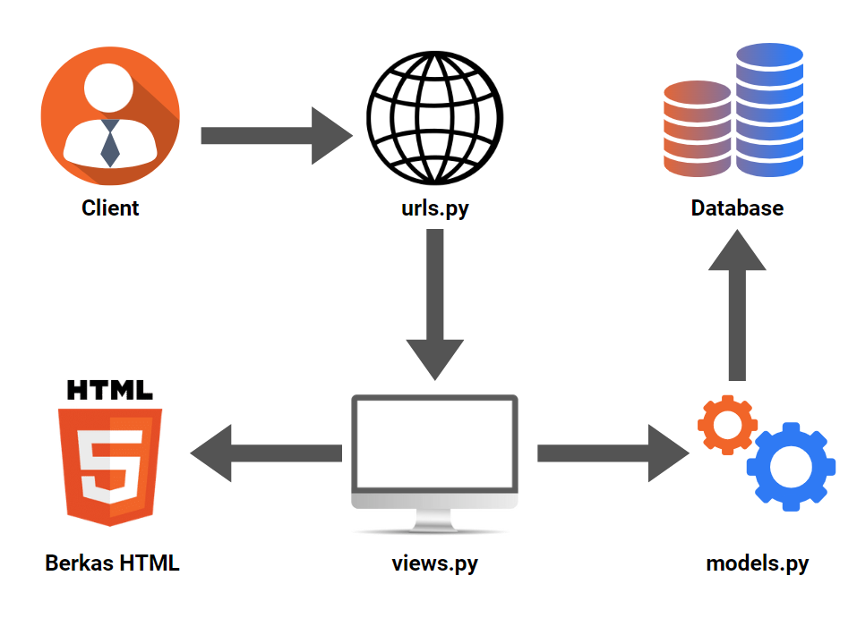

# Car Mart

### Ghana Ahmada Yudistira - 2206824760 - PBP B


**Car Mart** adalah aplikasi pengelolaan stok produk mobil yang digunakan untuk Tugas Individu pada mata kuliah Pemrograman Berbasis Platform (PBP)

**Link aplikasi**: *https://car-mart.adaptable.app/main/* 

## Pengerjaan Aplikasi  
### 1. Membuat sebuah proyek Django baru

Sebelum membuat proyek Django, saya membuat direktori lokal dan mempersiapkan *virtual environemnt* pada direktori tersebut dengan menjalankan perintah di bawah ini pada *command prompt* 
```sh
python -m venv env
env\Scripts\activate.bat # mengaktifkan virtual environment
```
karena saya akan membuat Django pada *virtual environment*, maka perlu dilakukan instalasi beberapa modul yang diperlukan oleh suatu perangkat lunak. Penggunaan *virtual environment* membantu mengisolasi modul antara proyek-proyek yang berbeda. Pada direktori yang sama, saya membuat berkas `requirements.txt` berisi
```
django
gunicorn
whitenoise
psycopg2-binary
requests
urllib3
```
Instalasi modul pada berkas tersebut dilakukan dengan menjalani perintah
```sh
pip install -r requirements.txt
```
Setelah modul diinstalasi, proyek Django bernama `car_mart` dapat dibuat
```sh
django-admin startproject car_mart .
```

### 2.  Membuat aplikasi dengan nama `main` pada proyek tersebut.

Pembuatan aplikasi dengan nama `main` pada proyek ini dilakukan dengan menjalankan perintah
```sh
python manage.py startapp main
```
Direktori `main` telah terbuat berisi struktur awal untuk aplikasi `main`.Aplikasi yang sudah dibuat perlu didaftarkan pada proyek utama dengan cara membuka berkas `settings.py` di dalam proyek utama (`car_mart`). Lalu tambahkan string nama aplikasi, `main`, pada variabel `INSTALLED_APPS`.
```python
INSTALLED_APPS = [
    ...,
    main,
]
```

### 3. Melakukan routing pada proyek agar dapat menjalankan aplikasi `main`.
Untuk menghubungkan aplikasi `main`, edit berkas `urls.py` pada direktori `car_mart` dan impor fungsi `include` dari `django.urls` untuk mengimpor rute URL dari aplikasi `main` ke dalam berkas `urls.py` proyek.
```python
from django.urls import path, include
```
Lalu, ditambahkan rute URL `/main` di dalam variabel `urlpatterns`.
```python
urlpatterns = [
    ...
    path('main/', include('main.urls')),
]
```

### 4. Membuat model pada aplikasi `main` dengan nama `Item`  dan memiliki atribut wajib sebagai berikut.
- `name` sebagai nama item dengan tipe `CharField`.
- `amount` sebagai jumlah item dengan tipe `IntegerField`.
- `description` sebagai deskripsi item dengan tipe `TextField`.
 
Model pada Django dapat diibaratkan sebagai Table dalam suatu basis data. Membuat model pada aplikasi `main` dilakukan dengan mengisi kode berikut pada berkas `models.py` dalam direktori `main`.
```python
from django.db import models

class Product(models.Model):
    name = models.CharField(max_length=255)
    amount = models.IntegerField()
    price = models.IntegerField()
    category = models.CharField(max_length=50)
    description = models.TextField()
```

Terbuat model bernama `Product` berisi lima atribut, yaitu:
- `name` menggunakan tipe data `CharField` dengan batasan 255 karakter.
- `amount` menggunakan tipe data `IntegerField`.
- `price` menggunakan tipe data `IntegerField`.
- `category` menggunakan tipe data `CharField` dengan batasan 50 karakter.
- `description` menggunakan tipe data `TextField`.

Setelah ini, diperlukan untuk mengubah struktur tabel basis data sesuai dengan perubahan model yang telah didefinisikan pada kode di atas dengan menjalankan perintah berikut.

```sh
# membuat migrasi model
python manage.py makemigrations 

# menerapkan migrasi ke dalam basis data lokal
python manage.py migrate 
```
 Apabila hanya mengubah kode program, pembaruan yang dilakukan tidak akan berdampak pada program Django karena belum adanya migrasi model.

### 5. Membuat sebuah fungsi pada `views.py` untuk dikembalikan ke dalam sebuah template HTML yang menampilkan nama aplikasi serta nama dan kelas kamu.
Template HTML adalah tampilan yang digunakan untuk menampilkan sesuatu pada laman *website*. Buat direktori bernama `templates` pada direktori `main` dan di dalamnya buat berkas baru bernama `nama.html` berisi kode untuk menampilkan data `nama` dan `kelas`.
```html
...
<div class="text-lg">
    <p><strong>Nama:</strong> {{ name }}</p>
    <p><strong>Kelas:</strong> {{ class }}</p>
</div>
...
```

Untuk menentukan template yang akan ditampilkan, kita menggunakan sebuah fungsi dalam berkas `views.py`.
```python
from django.shortcuts import render

def show_author(request):
    context = {
        "name": "Ghana Ahmada Yudistira",
        "class": "PBP B"
    }
    return render(request, "nama.html", context)
```
import fungsi render untuk me-render tampilan HTML menggunakan data yang diberikan. Fungsi `show_author` menerima request atau permintaan HTTP dan mengembalikan tampilan berkas HTML beserta data yang diberikan melalui *dictionary* pada variabel `context`.


### 6. Membuat sebuah routing pada `urls.py` aplikasi `main` untuk memetakan fungsi yang telah dibuat pada `views.py`.
Untuk menjalankan aplikasi `main`, perlu dibuat berkas `urls.py` pada direktori aplikasi `main` berisi
```python
from django.urls import path
from main.views import show_author

app_name = 'main'

urlpatterns = [
    path('', show_author, name='show_author'),
]
```
fungsi `path` memanggil fungsi `show_author` pada berkas `views.py` yang digunakan untuk menampilkan template HTML beserta data yang diberikan.

### 7. Melakukan deployment ke Adaptable terhadap aplikasi yang sudah dibuat sehingga nantinya dapat diakses oleh teman-temanmu melalui Internet.
Sebelum *deployment*, program perlu dicek terlebih dahulu dengan perintah
```sh
python manage.py runserver
```
Cek hasil program pada `http://localhost:8000/main`. Apabila program berhasil menampilkan tampilan dan data yang diinginkan, bisa mulai proses *deployment* pada Adaptable.

- Membuat repositori GitHUb bernama `car-mart` dengan visibilitas *public* dan inisiasi direktori lokal `car_mart` sebagai repositori Git.
- Membuat berkas .gitignore berisi komponen yang tidak ingin di-*push* ke GitHub.
- Buka laman Adaptable pada [Adaptable.io](https://adaptable.io/) dan *sign-in* menggunakan akun GitHub dengan repositori sebelumnya dibuat.
- Memilih repositori `car-mart` dan `main` *branch* yang dijadikan sebagai *deployment branch*.
- Memilih `Python App Template` sebagai *template deployment* dan `PostgreSQL` tipe basis data yang digunakan.
- Memilih versi Python `3.9`.
- Memasukkan `python manage.py migrate && gunicorn car_mart.wsgi` pada bagian `Start Command`.
- Memberi nama aplikasi `car-mart` sekaligus yang menjadi nama situs aplikasi.
- Menyentang bagian `HTTP Listener on PORT`.

Aplikasi berhasil di-*deploy* dan dapat diakses pada [link ini](https://car-mart.adaptable.app/main/).

## Bagan Aplikasi Django

- Client mengirimkan permintaan (HTTP Request) kepada server untuk mengambil halaman web melalui browser.
- Permintaan ini diteruskan ke sistem routing yang dikelola oleh Django dan mencari pola URL yang sesuai dengan permintaan klien.
- Setelah pola URL yang sesuai ditemukan, Django akan memanggil fungsi dalam berkas `views.py` yang telah terhubung dengan URL tersebut.
- Di dalam berkas `views.py`, Kita dapat menjalankan alur aplikasi dan operasi basis data sesuai dengan arsitektur yang telah ditentukan dalam `models.py`.
- Setelah semua operasi selesai, fungsi yang terpilih pada berkas `views.py` akan menghasilkan halaman web yang diminta oleh klien dalam berkas HTML atau disebut dengan `template`.
- Berkas HTML ini disimpan pada direktori `templates` untuk penggunaan berikutnya.
- Akhirnya, browser client akan merender berkas HTML ini sebagai tanggapan (HTTP Response) dari server Django sehingga menghasilkan tampilan yang terlihat oleh pengguna.
## Tujuan Penggunaan Virtual Environment
Kita tetap dapat membuat proyek Django tanpa menggunakan *environment variable* tetapi tidak cocok digunakan untuk pengembangan proyek yang besar karena satu tim belum tentu menggunakan versi modul yang sama. Dengan menggunakan *virtual environment*, kita dapat memisahkan versi modul yang digunakan pada setiap proyek yang berbeda, misalnya melalui berkas `requirements.txt` berisi modul yang digunakan pada proyek tersebut. Hal ini membantu mencegah konflik dan masalah keamanan yang mungkin muncul jika kita menggunakan versi yang tidak kompatibel atau berbeda. Alhasil, penggunaan *virtual environment* memungkinkan pengembangan proyek secara paralel dengan *developer* lain lebih efisien dibandingkan membuat proyek Django tanpa menggunakan *virtual environment* (*global environment*).

## Penjelasan MVC, MVT, dan MVVM
Model-View-Controller (MVC), Model-View-Template (MVT), dan Model-View-ViewModel (MVVM) adalah *design pattern* yang sering digunakan dalam arsitektur perangkat lunak. *Design pattern* merupakan panduan dan *template reusable* yang membantu pengembang perangkat lunak mengorganisir dan merancang kode mereka agar lebih efisien dan mudah dikembangkan.

### 1. Mode-View-Controller (MVC)
MVC menggunakan tiga komponen, yaitu Model, View, dan Controller. Model mewakili bagian aplikasi yang berhubungan dengan logika bisnis melalui mengelola dan memanipulasi data. View adalah komponen yang menampilkan tampilan atau antarmuka pengguna (UI) aplikasi. Controller adalah bagian yang mengelola interaksi antara pengguna, Model, dan View. Ini adalah komponen yang menerima input dari pengguna, mengirimnya ke Model untuk pemrosesan, dan mengatur tampilan yang sesuai di View.

### 2. Model-View-Template (MVT)
Komponen MVT hampir mirip dengan MVC, yaitu menggunakan Model yang berkaitan dengan logika bisnis melalui pengelolaan data dan View untuk mengatur tampilan. Sementara itu, MVT menggunakan Template sebagai tampilan HTML untuk menampilkan data dari Model. Perbedaan utama antara MVT dan MVC terletak pada penggunaan Template dalam MVT, yang memungkinkan pemisahan yang lebih jelas antara logika tampilan dan logika aplikasi. Controller pada desain ini sudah dikelola dari *Framework* yang digunakan.

### 3. Model-View-ViewModel (MVVM)
 Dalam desain MVVM, Model mengurus data dan logika inti. View mengatur tampilan yang dilihat oleh pengguna. ViewModel bertanggung jawab atas data *binding* yang memungkinkan sinkronisasi antara tampilan fungsi dan data dengan cara menyederhanakan pembaruan Model. 

**Perbedaan**: MVC, MVT, dan MVVM menggunakan komponen yang berbeda. MVC menggunakan Controller untuk mengatur alur Model dan View. MVT menggunakan Template untuk mengatur tampilan HTML dan tidak perlu mengelola Controller karena sudah dilakukan oleh *Framework*. Sementara MVVM menggunakan ViewModel sebagai perantara untuk menghubungkan tampilan dengan data melalui pembaruan Model. 


## Bonus
Membuat testing untuk memeriksa panjang karakter dan tipe data pada Model.