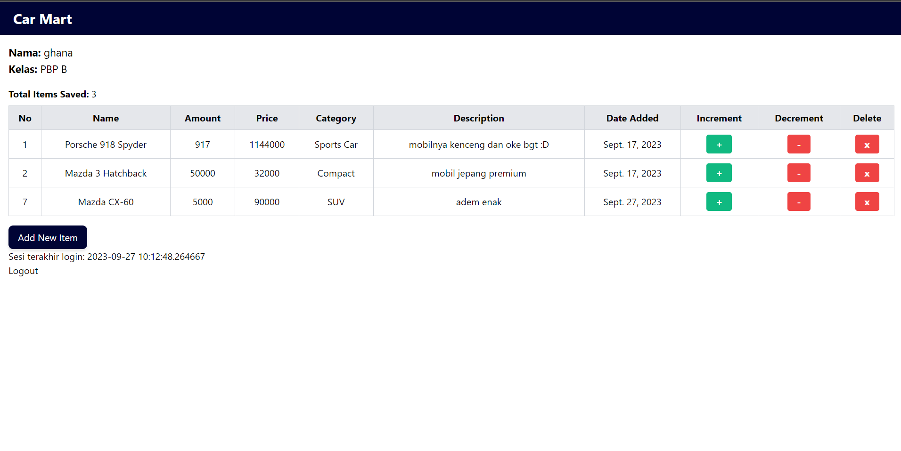
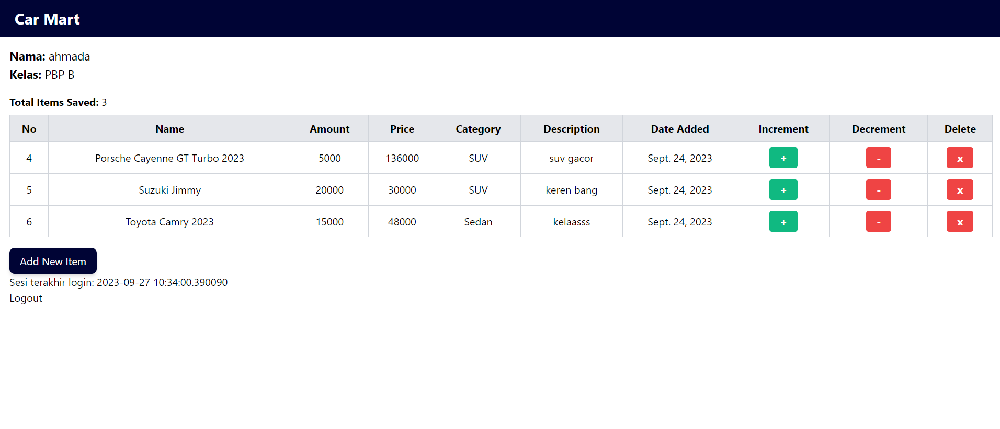
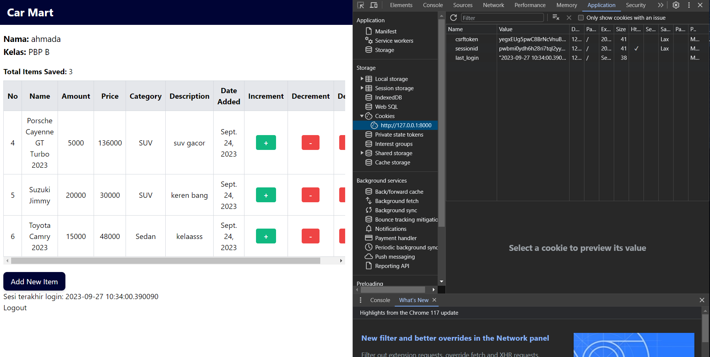
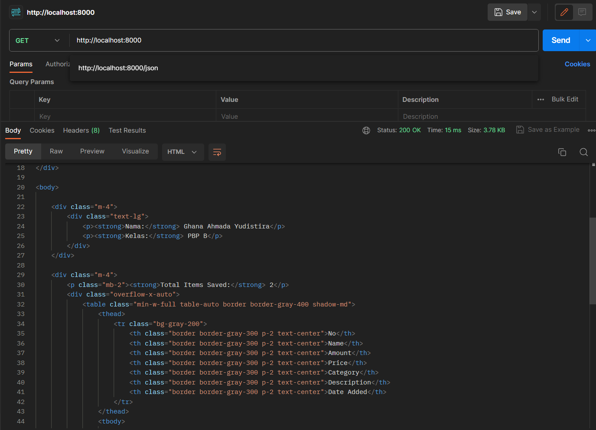
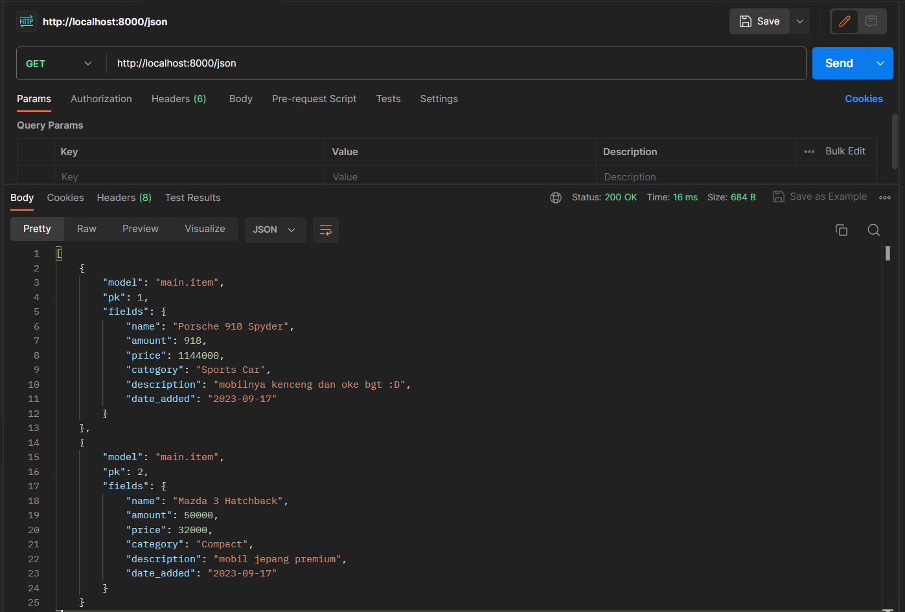
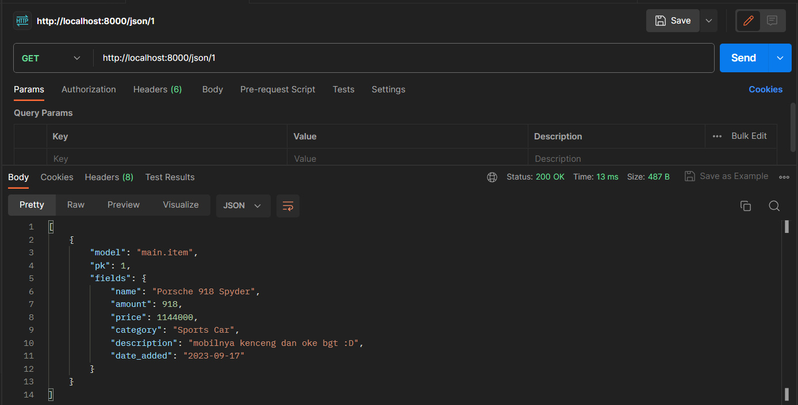
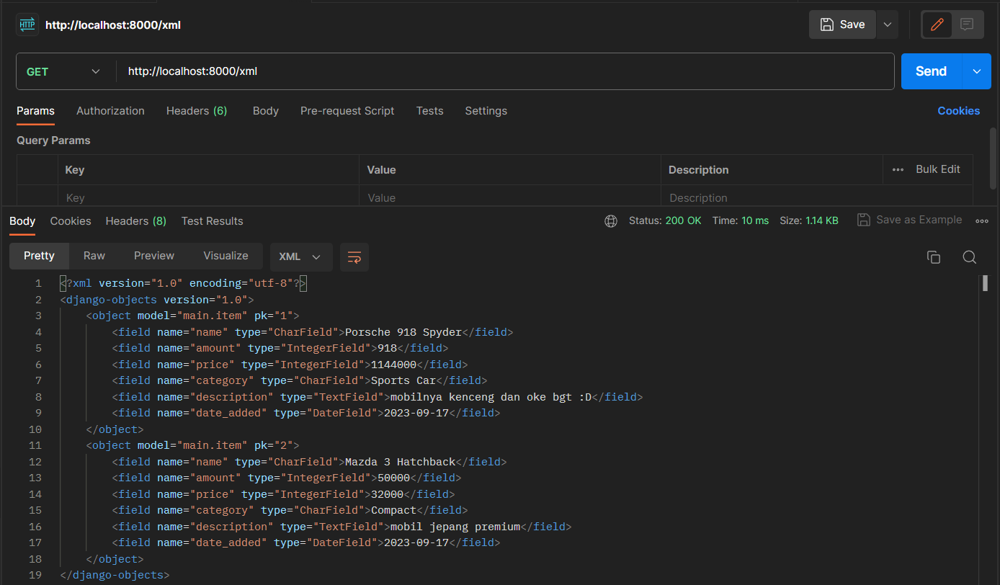
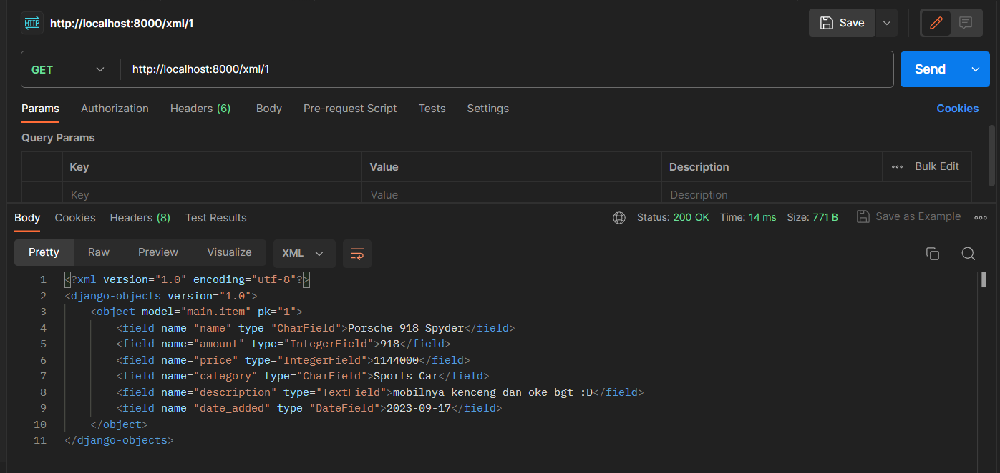
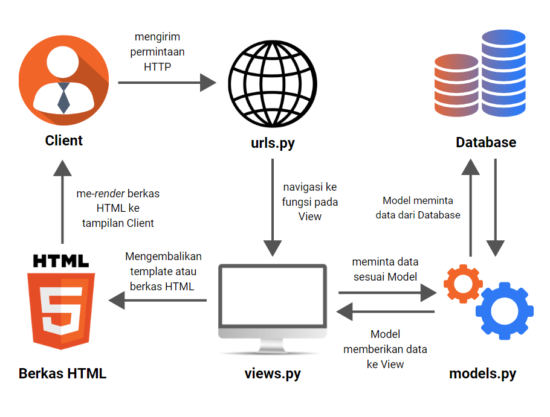

# Car Mart

### Ghana Ahmada Yudistira - 2206824760 - PBP B


**Car Mart** adalah aplikasi pengelolaan stok produk mobil yang digunakan untuk Tugas Individu pada mata kuliah Pemrograman Berbasis Platform (PBP)

**Link aplikasi**: *https://car-mart.adaptable.app/main/* 

## Tugas 4
### Apa itu Django `UserCreationForm`, dan jelaskan apa kelebihan dan kekurangannya?
`UserCreationForm` merupakan komponen dalam framework Django yang memiliki peran penting dalam pembuatan formulir pendaftaran pengguna (user registration form). Dalam konteks pengembangan aplikasi web Django, formulir ini memberikan kemudahan bagi pengguna untuk melakukan pendaftaran akun baru di situs web yang dikelola. Formulir ini secara efektif mengurangi kerumitan dalam proses penciptaan akun pengguna, serta mengelola validasi data yang diinputkan oleh pengguna.

**Kelebihan:**

- Mudah digunakan karena sudah menjadi bagian dari Django sehingga tinggal diimpor dan ditambahkan sedikit konfigurasi.

- Adanya validasi, seperti pengecekan *input* password sudah sesuai dengan ketentuan atau belum.

- Kompatibilitas dengan Model User Django sehingga memudahkan integrasinya dengan sistem otentikasi Django bawaan dan menyederhanakan manajemen pengguna di aplikasi.

**Kekurangan:**

- tidak cocok untuk formulir yang kompleks. Dalam beberapa kasus, kita mungkin memiliki kebutuhan yang sangat spesifik untuk formulir pendaftaran pengguna sehingga perlu membuat formulir kustom dari awal.

- memiliki keterbatasan dalam penampilan dengan desain yang cenderung sederhana sehingga memerlukan tampilan kustom yang dibangun dengan HTML, CSS, dan mungkin JavaScript untuk menciptakan formulir pendaftaran yang lebih kompleks dan estetik.

- adanya batasan pada validasi formulir sehingga perlu menambah atau membuat validasi baru jika belum tersedia.

### Apa perbedaan antara autentikasi dan otorisasi dalam konteks Django, dan mengapa keduanya penting?
Autentikasi adalah proses identifikasi pengguna dalam suatu aplikasi untuk memastikan bahwa pengguna yang mencoba mengakses sistem atau layanan adalah mereka yang seharusnya dan memiliki hak akses yang sesuai. Otorisasi adalah pemberian akses pada pengguna sesuai tipe pengguna yang sudah ditentukan pada Django sehingga memungkinkan pengendalian yang lebih terperinci terhadap fungsi dan data. Jadi perbedaan antara keduanya autentikasi adalah proses identifikasi pengguna, sedangkan otorisasi adalah pemberian hak akses pada pengguna setelah mereka diidentifikasi.

Keduanya penting karena autentikasi memastikan identitas pengguna yang sah, sementara otorisasi mengontrol hak akses pengguna terhadap data dan fungsi tertentu sehingga menjaga keamanan dan privasi serta memastikan pengguna hanya dapat melakukan tindakan yang sesuai dengan perannya dalam aplikasi.

### Apa itu `cookies` dalam konteks aplikasi web, dan bagaimana Django menggunakan `cookies` untuk mengelola data sesi pengguna?
`Cookies` adalah file kecil yang digunakan oleh situs web untuk menyimpan informasi tentang pengguna, seperti login, preferensi bahasa, dan riwayat pencarian. `Cookies` berperan dalam mengelola data sesi pengguna, yang merupakan informasi yang disimpan oleh server selama pengguna menjalankan aplikasi web.

Django menggunakan `cookies` untuk mengelola data sesi pengguna dengan cara yang sistematis. Ketika pengguna mengakses situs, Django memberikan ID sesi unik yang disimpan dalam `cookie` di peramban mereka. Data sesi, seperti informasi login atau preferensi, dapat disimpan dalam server dan diakses melalui ID sesi ini. Saat pengguna melakukan permintaan ke server, Django membaca ID sesi dari `cookie`, memungkinkan pengidentifikasian pengguna dan penggunaan data sesi untuk memberikan pengalaman yang sesuai. Django juga mengamankan data sesi dengan mengenkripsi ID sesi dan menambahkan tanda tangan untuk menjaga keamanan dan integritas data sesi. Dengan cara ini, Django memungkinkan pengembang untuk menyediakan pengalaman yang lebih personal dalam aplikasi web mereka.


### Apakah penggunaan cookies aman secara default dalam pengembangan web, atau apakah ada risiko potensial yang harus diwaspadai?
Penggunaan `cookies` dalam pengembangan web dapat membawa risiko keamanan yang signifikan jika tidak dikelola dengan hati-hati. `Cookies` dapat mengandung informasi sensitif dan jika tidak diimplementasikan dengan benar dapat dieksploitasi oleh penyerang untuk mencuri data pengguna atau melakukan serangan terhadap situs web. Dengan demikian, pengembang web perlu mengambil langkah-langkah keamanan yang tepat, seperti mengenkripsi data dalam `cookies` untuk melindungi informasi tersebut, menetapkan waktu kadaluwarsa `cookies` sesuai dengan kebutuhan, dan memastikan bahwa `cookies` hanya digunakan melalui koneksi yang aman (HTTPS) untuk mengurangi risiko eksploitasi. Dengan cara ini, penggunaan `cookies` dalam pengembangan web dapat tetap berguna dan efisien sambil menjaga keamanan data pengguna yang krusial.

### Implementasi Autentikasi, Session, dan Cookies pada Django

### 1. Mengimplementasikan fungsi registrasi, login, dan logout untuk memungkinkan pengguna untuk mengakses aplikasi sebelumnya dengan lancar.
- Untuk membuat fungsi registrasi, saya menggunakan `UserCreationForm` yang sudah disediakan oleh Django supaya tidak perlu menulis kode dari awal.

    ```python
    from django.shortcuts import redirect
    from django.contrib.auth.forms import UserCreationForm
    from django.contrib import messages  

    def register(request):
        form = UserCreationForm()

        if request.method == "POST":
            form = UserCreationForm(request.POST)
            if form.is_valid():
                form.save()
                messages.success(request, 'Your account has been successfully created!')
                return redirect('main:login')
        context = {'form':form}
        return render(request, 'register.html', context)
    ```

    Setelah itu, saya membuat template `register.html` untuk menampilkan halaman *register* dan melakukan *routing* ke template tersebut pada `urls.py` dengan fungsi `register` yang baru dibuat pada `view`
    ```python
    ...
    path('register/', register, name='register'),
    ...
    ```

- Untuk mmebuat fungsi login, saya menggunakan fungsi `authenticate` dan `login` dari Django untuk mempermudah proses login.

    ```python
    from django.contrib.auth import authenticate, login

    def login_user(request):
    if request.method == 'POST':
        username = request.POST.get('username')
        password = request.POST.get('password')
        user = authenticate(request, username=username, password=password)
        if user is not None:
            login(request, user)
            return redirect('main:show_main')
        else:
            messages.info(request, 'Sorry, incorrect username or password. Please try again.')
    context = {}
    return render(request, 'login.html', context)
    ```

    Setelah itu, saya membuat template `login.html` untuk menampilkan halaman *login* dan melakukan *routing* ke template tersebut pada `urls.py` dengan fungsi `login` yang baru dibuat pada `view`
    ```python
    ...
    path('login/', login, name='login'),
    ...
    ```

- Untuk membuat fungsi logout, saya menggunakan fungsi `logout` dari Django.

    ```python
    from django.contrib.auth import logout

    def logout_user(request):
        logout(request)
        return redirect('main:login')
    ```

    Setelah itu, saya memodifikasi template `main.html` dengan menambahkan *button* `logout` dan melakukan *routing* pada `urls.py` dengan fungsi `logout_user` yang baru dibuat pada `view`

    ```python
    path('logout/', logout_user, name='logout'),
    ```

### 2. Membuat **dua** akun pengguna dengan masing-masing **tiga** dummy data menggunakan model yang telah dibuat pada aplikasi sebelumnya untuk setiap akun **di lokal**.
Akun pertama:


Akun kedua:


### 3. Menghubungkan model `Item` dengan `User`.
Sebelum menghubungkan model `Item` dengan `User`, saya melakukan register akun terlebih dahulu. Lalu, memodifikasi Model dengan mengganti

```python
...
from django.contrib.auth.models import User

class Item(models.Model):
    user = models.ForeignKey(User, on_delete=models.CASCADE)
...
```
Saya juga memodifikasi fungsi `create_item` pada `view` supaya tambahan item baru terasosiasi dengan user yang sedang login.

```python
def create_item(request):
    form = ItemForm(request.POST or None)

    if form.is_valid() and request.method == "POST":
        product = form.save(commit=False)
        product.user = request.user
        product.save()
        return HttpResponseRedirect(reverse('main:show_main'))

    context = {'form': form}
    return render(request, "create_item.html", context)
```

Terakhir, simpan semua perubahan dengan melakukan migrasi model.

### 4. Menampilkan detail informasi pengguna yang sedang logged in seperti username dan menerapkan `cookies` seperti `last login` pada halaman utama aplikasi.

Saya mengganti `name` pada halaman main sesuai dengan username user yang login

```python
def show_main(request):
    products = Product.objects.filter(user=request.user)

    context = {
        'name': request.user.username,
        ...
```
Untuk menerapkan `cookies` last login, saya menambahkan `key` pada `context` di fungsi `show_main` yaitu
```python
context = {
        ...
        'last_login': request.COOKIES['last_login'],
            }
```
Lalu, ditambahkan juga status kapan user login terakhir kali pada `main.html`

```html
<h5>Sesi terakhir login: {{ last_login }}</h5>
```

#### Tampilan last login session


### Bonus
Membuat `button` untuk menambah dan mengurangi 1 amount pada tiap `item` serta `button` untuk menghapus `item` dari kepemilikan `user` yang terasosiasi.


## Tugas 3
### Perbedaan antara form `POST` dan `GET` dalam Django
`POST` digunakan untuk mengirim data ke server untuk diproses. Ini tidak idempoten, yang berarti setiap kali dipanggil, dapat membuat sumber daya baru atau mengubah yang sudah ada. Permintaan `POST` biasanya digunakan untuk membuat atau memperbarui data, seperti mengirimkan formulir atau mengunggah file. 

```python
def registration(request):
    if request.method == 'POST':
        # Proses data formulir yang dikirim oleh pengguna
        # ...
```

`GET` digunakan untuk mengambil data dari server tanpa mengubahnya. Metode ini dianggap aman dan idempoten, yang berarti dapat dipanggil berkali-kali tanpa mengubah hasilnya. Permintaan `GET` biasanya digunakan untuk mengambil data untuk ditampilkan di halaman web, seperti daftar produk atau artikel.
```python
def search(request):
    query = request.GET.get('q')
    # Misal mencari data yang sesuai dari hasil query
    # ...
```

### Perbedaan antara XML, JSON, dan HTML dalam pengiriman data
XML atau Extensible Markup Language memiliki struktur tag yang sangat deskriptif sehingga biasa digunakan untuk representasi data secara terstruktur. XML memiliki tag yang ditulis dalam `<>` untuk mendeskripsikan secara singkat konten yang disimpan.

```xml
<?xml version="1.0" encoding="utf-8"?>
<django-objects version="1.0">
    <object model="main.item" pk="2">
        <field name="name" type="CharField">Mazda 3 Hatchback</field>
        <field name="amount" type="IntegerField">50000</field>
        <field name="price" type="IntegerField">32000</field>
        <field name="category" type="CharField">Compact</field>
        <field name="description" type="TextField">mobil jepang premium</field>
        <field name="date_added" type="DateField">2023-09-17</field>
    </object>
</django-objects>
```

JSON atau JavaScript Object Notation memiliki struktur seperti `dictionary` dengan pasangan `key:value` yang dapat disimpan dalam `list`. Data yang disimpan dalam format JSON lebih ringkas dan mudah dibaca sehingga cocok digunakan untuk pertukaran data terstruktur antara server dengan klien web.
```json
[
    {
        "model": "main.item",
        "pk": 2,
        "fields": {
            "name": "Mazda 3 Hatchback",
            "amount": 50000,
            "price": 32000,
            "category": "Compact",
            "description": "mobil jepang premium",
            "date_added": "2023-09-17"
        }
    }
]
```

HTML atau Hypertext Markup Language adalah bahasa markup yang digunakan untuk mengorganisir dan menampilkan data pada halaman web kepada pengguna akhir. Contoh elemen yang dapat ditampilkan dengan HTML adalah teks, gambar, dan tautan.

```html
<div class="m-4">
    <div class="text-lg">
        <p><strong>Nama:</strong> {{ name }}</p>
        <p><strong>Kelas:</strong> {{ class }}</p>
    </div>
</div>
```

### Mengapa JSON sering digunakan dalam pertukaran data antara aplikasi web modern?
JSON sering digunakan dalam pertukaran data antara aplikasi web modern karena memiliki format yang ringkas dan mudah dibaca sehingga *developer* tidak kesulitan memahami struktur data JSON ketimbang strukur data lainnya serta lebih efisien dalam hal ukuran penyimpanan data. Selain keuntungan tersebut, JSON juga sering digunakan karena kompatibilitasnya yang luas dengan berbagai bahasa pemrograman. Banyak bahasa pemrograman, seperti JavaScript, Python, Java, C#, dan lainnya, memiliki *library* khusus yang memudahkan pengolahan data dalam format JSON. Hal ini menjadikan JSON sebagai pilihan yang sangat fleksibel untuk pertukaran data antara aplikasi yang ditulis dalam berbagai bahasa pemrograman sehingga mempermudah integrasi antara sistem-sistem yang berbeda.

### Implementasi Form dan Data Delivery pada Django
### 1. Membuat input `form` untuk menambahkan objek model pada app sebelumnya
saya membuat berkas `forms.py` pada direktori `main` yang akan mengimplementasikan library `django.forms` untuk menyederhanakan proses pembuatan `form` dalam Django.

```python
from django.forms import ModelForm
from main.models import Item

class ItemForm(ModelForm):
    class Meta:
        model = Item
        fields = ["name", "amount", "price", "category", "description"]
```
Untuk merender tampilan form pada web, kita perlu membuat `view` yang menghubungkan mekanisme form Django dengan template untuk form kita. Saya menambahkan beberapa impor modul dan fungsi berikut pada `views.py`.
```python
from django.http import HttpResponseRedirect
from main.forms import ItemForm
from django.urls import reverse

def create_item(request):
    form = ItemForm(request.POST or None)

    if form.is_valid() and request.method == "POST":
        form.save()
        return HttpResponseRedirect(reverse('main:show_main'))

    context = {'form': form}
    return render(request, "create_item.html", context)
```
fungsi di atas akan melakukan validasi (`form.is_valid()`) dan menyimpan (`form.save()`) isi input dari *form* tersebut lalu merender `create_item.html` sebagai tampilan *form* pada web. Apabila pengguna sudah menyimpan input dari *form*, halaman web akan *redirect* ke `main:show_main` (`HttpResponseRedirect`).

mengedit fungsi `show_main` pada `views.py` dengan tambahan kode `items = Item.objects.all()` untuk mengambil data item yang ditambahkan dan `item_count = len(items)` untuk mengambil jumlah data item yang sudah ditambahkan.

Melakukan routing di `urls.py` pada direktori `main` dengan menambahkan kode berikut

```python
urlpatterns = [
    ...,
     path('create-item', create_item, name='create_item'),
]
```
Setelah pola URL `view` ditambahkan pada `urls.py`, saya membuat `template` dengan nama `create_item.html`. Saya menggunakan `<form method="POST">` untuk mendefinisikan tipe form `POST` dan `` untuk mencegah serangan CSFR (Cross-site request forgery), yaitu memaksa pengguna yang sudah terautentikasi untuk mengirim permintaan ke aplikasi web tanpa sepengetahuan mereka. Untuk membuat 1 field dari form, saya menggunakan potongan kode berikut
```html
<div class="mb-4 border rounded-lg p-2">
    <label class="font-semibold">{{ form.name.label_tag }}</label>
    {{ form.name }}
</div>
```
`form.name.label_tag` mengembalikan nama atribut, dalam kasus ini adalah `name`. `form.name` mengembalikan input untuk atribut `name` yang dapat diisi oleh pengguna.

### 2. Menambahkan 5 fungsi `views` untuk melihat pengiriman data 
Pada Tugas 2, saya sudah membuat satu fungsi `view` untuk mleihat pengiriman data melalui format HTML, yaitu
```python
def show_main(request):
    items = Item.objects.all()
    item_count = len(items)
    context = {
        "name": "Ghana Ahmada Yudistira",
        "class": "PBP B",
        "items": items,
        "item_count": item_count
    }
    return render(request, "main.html", context)
```
Berikut adalah 4 fungsi `views` yang ditambahkan untuk melihat pengiriman data melalui format:
- **JSON**, Membuat fungsi `show_json` pada `views.py` berisi kode di bawah untuk melihat dan mengembalikan tampilan data dalam format JSON.
    ```python
    def show_json(request):
        data = Item.objects.all()
        return HttpResponse(serializers.serialize("json", data), content_type="application/json")
    ```
- **JSON berdasarkan Id**, Membuat fungsi `show_json_by_id` pada `views.py` berisi kode di bawah untuk melihat dan mengembalikan tampilan data dalam format JSON berdasarkan id yang diminta.
    ```python
    def show_json_by_id(request, id):
        data = Item.objects.filter(pk=id)
        return HttpResponse(serializers.serialize("json", data), content_type="application/json")
    ```
- **XML**, Membuat fungsi `show_xml` pada `views.py` berisi kode di bawah untuk melihat dan mengembalikan tampilan data dalam format XML.
    ```python
    def show_xml(request):
        data = Item.objects.all()
        return HttpResponse(serializers.serialize("xml", data), content_type="application/xml")
    ```
- **XML berdasarkan Id**, Membuat fungsi `show_xml_id` pada `views.py` berisi kode di bawah untuk melihat dan mengembalikan tampilan data dalam format XML berdasarkan id yang diminta.
    ```python
    def show_xml(request, id):
        data = Item.objects.filter(pk=id)
        return HttpResponse(serializers.serialize("xml", data), content_type="application/xml")
    ```


### 3. Membuat routing URL untuk masing-masing `views`
Setelah menambahkan 5 fungsi `views`, saya menambahkan path kelima routing url tersebut pada `urls.py` dalam direktori `main`.

```python
[
    ...
    path('', show_main, name='show_main'), 
    path('xml/', show_xml, name='show_xml'), 
    path('json/', show_json, name='show_json'), 
    path('xml/<int:id>/', show_xml_by_id, name='show_xml_by_id'),
    path('json/<int:id>/', show_json_by_id, name='show_json_by_id'),
]
```
fungsi `path` menerima 3 argumen, yaitu:
- Argumen pertama adalah pernyataan path yang menentukan pola URL. Dalam kasus `<int:id>`, ini adalah bagian dari URL yang bersifat dinamis, yaitu tempat di mana nilai-nilai berbeda akan ditangkap saat URL diakses dan nilai-nilai ini akan digunakan dalam fungsi `view` terkait.
- Argumen kedua memanggil fungsi `view` yang diinginkan.
- Argumen ketiga adalah nama unik kepada URL ini yang digunakan untuk mengidentifikasi URL secara unik dalam aplikasi dan dapat digunakan untuk membuat tautan ke URL ini dari `template`.

### 4. Screenshot Postman
#### Hasil akses view HTML

#### Hasil akses view JSON

#### Hasil akses view JSON berdasarkan id

#### Hasil akses view XML

#### Hasil akses view XML berdasarkan id


### Bonus Tugas 3
Saya menambahkan potongan kode berikut untuk menampilkan jumlah data item yang sudah tersimpan pada *database*.
```html
<p class="mb-2"><strong>Total Items Saved:</strong> {{ item_count }}</p>
```
variabel `item_count` didapat dari fungsi view `show_main` berikut.
```python
def show_main(request):
    items = Item.objects.all()
    item_count = len(items)
    context = {
        "name": "Ghana Ahmada Yudistira",
        "class": "PBP B",
        "items": items,
        "item_count": item_count
    }
    return render(request, "main.html", context)
```

## Tugas 2 
### Pengerjaan Aplikasi  
### 1. Membuat sebuah proyek Django baru

Sebelum membuat proyek Django, saya membuat direktori lokal dan mempersiapkan *virtual environemnt* pada direktori tersebut dengan menjalankan perintah di bawah ini pada *command prompt* 
```sh
python -m venv env
env\Scripts\activate.bat # mengaktifkan virtual environment
```
karena saya akan membuat Django pada *virtual environment*, maka perlu dilakukan instalasi beberapa modul yang diperlukan oleh suatu perangkat lunak. Penggunaan *virtual environment* membantu mengisolasi modul antara proyek-proyek yang berbeda. Pada direktori yang sama, saya membuat berkas `requirements.txt` berisi
```
django
gunicorn
whitenoise
psycopg2-binary
requests
urllib3
```
Instalasi modul pada berkas tersebut dilakukan dengan menjalani perintah
```sh
pip install -r requirements.txt
```
Setelah modul diinstalasi, proyek Django bernama `car_mart` dapat dibuat
```sh
django-admin startproject car_mart .
```

### 2.  Membuat aplikasi dengan nama `main` pada proyek tersebut.

Pembuatan aplikasi dengan nama `main` pada proyek ini dilakukan dengan menjalankan perintah
```sh
python manage.py startapp main
```
Direktori `main` telah terbuat berisi struktur awal untuk aplikasi `main`.Aplikasi yang sudah dibuat perlu didaftarkan pada proyek utama dengan cara membuka berkas `settings.py` di dalam proyek utama (`car_mart`). Lalu tambahkan string nama aplikasi, `main`, pada variabel `INSTALLED_APPS`.
```python
INSTALLED_APPS = [
    ...,
    main,
]
```

### 3. Melakukan routing pada proyek agar dapat menjalankan aplikasi `main`.
Untuk menghubungkan aplikasi `main`, edit berkas `urls.py` pada direktori `car_mart` dan impor fungsi `include` dari `django.urls` untuk mengimpor rute URL dari aplikasi `main` ke dalam berkas `urls.py` proyek.
```python
from django.urls import path, include
```
Lalu, ditambahkan rute URL `/main` di dalam variabel `urlpatterns`.
```python
urlpatterns = [
    ...
    path('main/', include('main.urls')),
]
```

### 4. Membuat model pada aplikasi `main` dengan nama `Item`  dan memiliki atribut wajib sebagai berikut.
- `name` sebagai nama item dengan tipe `CharField`.
- `amount` sebagai jumlah item dengan tipe `IntegerField`.
- `description` sebagai deskripsi item dengan tipe `TextField`.
 
Model pada Django dapat diibaratkan sebagai Table dalam suatu basis data. Membuat model pada aplikasi `main` dilakukan dengan mengisi kode berikut pada berkas `models.py` dalam direktori `main`.
```python
from django.db import models

class Item(models.Model):
    name = models.CharField(max_length=255)
    amount = models.IntegerField()
    price = models.IntegerField()
    category = models.CharField(max_length=50)
    description = models.TextField()
```

Terbuat model bernama `Item` berisi lima atribut, yaitu:
- `name` menggunakan tipe data `CharField` dengan batasan 255 karakter.
- `amount` menggunakan tipe data `IntegerField`.
- `price` menggunakan tipe data `IntegerField`.
- `category` menggunakan tipe data `CharField` dengan batasan 50 karakter.
- `description` menggunakan tipe data `TextField`.

Setelah ini, diperlukan untuk mengubah struktur tabel basis data sesuai dengan perubahan model yang telah didefinisikan pada kode di atas dengan menjalankan perintah berikut.

```sh
# membuat migrasi model
python manage.py makemigrations 

# menerapkan migrasi ke dalam basis data lokal
python manage.py migrate 
```
 Apabila hanya mengubah kode program, pembaruan yang dilakukan tidak akan berdampak pada program Django karena belum adanya migrasi model.

### 5. Membuat sebuah fungsi pada `views.py` untuk dikembalikan ke dalam sebuah template HTML yang menampilkan nama aplikasi serta nama dan kelas kamu.
Template HTML adalah tampilan yang digunakan untuk menampilkan sesuatu pada laman *website*. Buat direktori bernama `templates` pada direktori `main` dan di dalamnya buat berkas baru bernama `nama.html` berisi kode untuk menampilkan data `nama` dan `kelas`.
```html
...
<div class="text-lg">
    <p><strong>Nama:</strong> {{ name }}</p>
    <p><strong>Kelas:</strong> {{ class }}</p>
</div>
...
```

Untuk menentukan template yang akan ditampilkan, kita menggunakan sebuah fungsi dalam berkas `views.py`.
```python
from django.shortcuts import render

def show_author(request):
    context = {
        "name": "Ghana Ahmada Yudistira",
        "class": "PBP B"
    }
    return render(request, "nama.html", context)
```
import fungsi render untuk me-render tampilan HTML menggunakan data yang diberikan. Fungsi `show_author` menerima request atau permintaan HTTP dan mengembalikan tampilan berkas HTML beserta data yang diberikan melalui *dictionary* pada variabel `context`.


### 6. Membuat sebuah routing pada `urls.py` aplikasi `main` untuk memetakan fungsi yang telah dibuat pada `views.py`.
Untuk menjalankan aplikasi `main`, perlu dibuat berkas `urls.py` pada direktori aplikasi `main` berisi
```python
from django.urls import path
from main.views import show_author

app_name = 'main'

urlpatterns = [
    path('', show_author, name='show_author'),
]
```
fungsi `path` memanggil fungsi `show_author` pada berkas `views.py` yang digunakan untuk menampilkan template HTML beserta data yang diberikan.

### 7. Melakukan deployment ke Adaptable terhadap aplikasi yang sudah dibuat sehingga nantinya dapat diakses oleh teman-temanmu melalui Internet.
Sebelum *deployment*, program perlu dicek terlebih dahulu dengan perintah
```sh
python manage.py runserver
```
Cek hasil program pada `http://localhost:8000/main`. Apabila program berhasil menampilkan tampilan dan data yang diinginkan, bisa mulai proses *deployment* pada Adaptable.

- Membuat repositori GitHUb bernama `car-mart` dengan visibilitas *public* dan inisiasi direktori lokal `car_mart` sebagai repositori Git.
- Membuat berkas .gitignore berisi komponen yang tidak ingin di-*push* ke GitHub.
- Buka laman Adaptable pada [Adaptable.io](https://adaptable.io/) dan *sign-in* menggunakan akun GitHub dengan repositori sebelumnya dibuat.
- Memilih repositori `car-mart` dan `main` *branch* yang dijadikan sebagai *deployment branch*.
- Memilih `Python App Template` sebagai *template deployment* dan `PostgreSQL` tipe basis data yang digunakan.
- Memilih versi Python `3.9`.
- Memasukkan `python manage.py migrate && gunicorn car_mart.wsgi` pada bagian `Start Command`.
- Memberi nama aplikasi `car-mart` sekaligus yang menjadi nama situs aplikasi.
- Menyentang bagian `HTTP Listener on PORT`.

Aplikasi berhasil di-*deploy* dan dapat diakses pada [link ini](https://car-mart.adaptable.app/main/).

### Bagan Aplikasi Django

- Client mengirimkan permintaan (HTTP Request) kepada server untuk mengambil halaman web melalui browser.
- Permintaan ini diteruskan ke sistem routing yang dikelola oleh Django dan mencari pola URL yang sesuai dengan permintaan klien.
- Setelah pola URL yang sesuai ditemukan, Django akan memanggil fungsi dalam berkas `views.py` yang telah terhubung dengan URL tersebut.
- Di dalam berkas `views.py`, Kita dapat menjalankan alur aplikasi dan operasi basis data sesuai dengan arsitektur yang telah ditentukan dalam `models.py`.
- Setelah semua operasi selesai, fungsi yang terpilih pada berkas `views.py` akan menghasilkan halaman web yang diminta oleh klien dalam berkas HTML atau disebut dengan `template`.
- Berkas HTML ini disimpan pada direktori `templates` untuk penggunaan berikutnya.
- Akhirnya, browser client akan merender berkas HTML ini sebagai tanggapan (HTTP Response) dari server Django sehingga menghasilkan tampilan yang terlihat oleh pengguna.
### Tujuan Penggunaan Virtual Environment
Kita tetap dapat membuat proyek Django tanpa menggunakan *environment variable* tetapi tidak cocok digunakan untuk pengembangan proyek yang besar karena satu tim belum tentu menggunakan versi modul yang sama. Dengan menggunakan *virtual environment*, kita dapat memisahkan versi modul yang digunakan pada setiap proyek yang berbeda, misalnya melalui berkas `requirements.txt` berisi modul yang digunakan pada proyek tersebut. Hal ini membantu mencegah konflik dan masalah keamanan yang mungkin muncul jika kita menggunakan versi yang tidak kompatibel atau berbeda. Alhasil, penggunaan *virtual environment* memungkinkan pengembangan proyek secara paralel dengan *developer* lain lebih efisien dibandingkan membuat proyek Django tanpa menggunakan *virtual environment* (*global environment*).

### Penjelasan MVC, MVT, dan MVVM
Model-View-Controller (MVC), Model-View-Template (MVT), dan Model-View-ViewModel (MVVM) adalah *design pattern* yang sering digunakan dalam arsitektur perangkat lunak. *Design pattern* merupakan panduan dan *template reusable* yang membantu pengembang perangkat lunak mengorganisir dan merancang kode mereka agar lebih efisien dan mudah dikembangkan.

### 1. Mode-View-Controller (MVC)
MVC menggunakan tiga komponen, yaitu Model, View, dan Controller. Model mewakili bagian aplikasi yang berhubungan dengan logika bisnis melalui mengelola dan memanipulasi data. View adalah komponen yang menampilkan tampilan atau antarmuka pengguna (UI) aplikasi. Controller adalah bagian yang mengelola interaksi antara pengguna, Model, dan View. Ini adalah komponen yang menerima input dari pengguna, mengirimnya ke Model untuk pemrosesan, dan mengatur tampilan yang sesuai di View.

### 2. Model-View-Template (MVT)
Komponen MVT hampir mirip dengan MVC, yaitu menggunakan Model yang berkaitan dengan logika bisnis melalui pengelolaan data dan View untuk mengatur tampilan. Sementara itu, MVT menggunakan Template sebagai tampilan HTML untuk menampilkan data dari Model. Perbedaan utama antara MVT dan MVC terletak pada penggunaan Template dalam MVT, yang memungkinkan pemisahan yang lebih jelas antara logika tampilan dan logika aplikasi. Controller pada desain ini sudah dikelola dari *Framework* yang digunakan.

### 3. Model-View-ViewModel (MVVM)
 Dalam desain MVVM, Model mengurus data dan logika inti. View mengatur tampilan yang dilihat oleh pengguna. ViewModel bertanggung jawab atas data *binding* yang memungkinkan sinkronisasi antara tampilan fungsi dan data dengan cara menyederhanakan pembaruan Model. 

**Perbedaan**: MVC, MVT, dan MVVM menggunakan komponen yang berbeda. MVC menggunakan Controller untuk mengatur alur Model dan View. MVT menggunakan Template untuk mengatur tampilan HTML dan tidak perlu mengelola Controller karena sudah dilakukan oleh *Framework*. Sementara MVVM menggunakan ViewModel sebagai perantara untuk menghubungkan tampilan dengan data melalui pembaruan Model. 


### Bonus Tugas 2
Membuat testing untuk memeriksa panjang karakter dan tipe data pada Model.